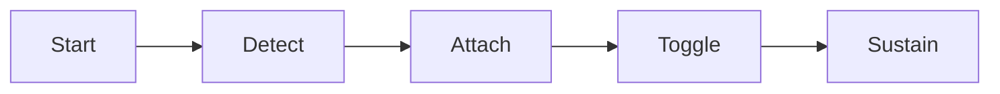

# gta5-money-trainer 💰🎮

  

*Your single-player Los Santos, on your terms — unlimited money, zero friction.*

  

## 🌆 Overview

Grinding heists, waiting on stock market swings, or re-running the same contact mission for the tenth time just to afford the next garage — sound familiar? **gta5-money-trainer** exists because the single-player economy in GTA V was tuned for a live-service grind, not for someone who just wants to build custom cars, own every property, and mess around in Los Santos without a spreadsheet mentality.

This project is a lightweight desktop companion for the PC version of GTA V, built to hand single-player fans a fast, transparent way to manage their in-game bankroll. It's aimed at story-mode players, sandbox tinkerers, screenshot artists, and modding hobbyists who care more about *what happens in the world* than *how many hours it took to afford it*. It is **not** a multiplayer tool — GTA Online has its own economy and its own rules, and this project intentionally stays out of that lane.

Under the hood it's a small, self-contained Windows utility — no background services, no telemetry, no hidden processes. You launch it, it reads your session, you toggle what you want, you go play. That's the entire philosophy: a trainer that respects your time and your PC.

## 🚀 Get the Latest Build

> [!NOTE]
> The download button always points to the official landing page, where the current build, changelog, and setup notes live. Bookmark it — that's the only place we publish builds.

---

## 🧰 What It Actually Does

| Capability | The Fresh Angle |
|---|---|
| **Unlimited Money Toggle** | Flip your single-player cash balance to a sustained high value instead of babysitting it after every purchase. |
| **Instant Balance Refill** | Set-and-forget refill logic keeps your funds topped up so a big property buy never leaves you scrambling. |
| **Property & Garage Friendly** | Built with the "buy everything, worry about nothing" player in mind — designed around real estate and vehicle collecting. |
| **Session-Aware Detection** | Automatically recognizes when GTA V is running and attaches cleanly, no manual process hunting required. |
| **Lightweight Overlay Menu** | A minimal in-session panel that stays out of your screenshots until you summon it. |
| **Safe-Mode Story Focus** | Deliberately scoped to single-player campaign saves — it doesn't reach into online modes. |
| **One-Click Revert** | Undo any active toggle instantly if you want your economy back to "normal" for a mission. |
| **Zero Background Footprint** | Closes cleanly with no leftover services, scheduled tasks, or startup entries. |

> [!TIP]
> New to trainers in general? Start with just the money toggle before touching anything else. It's the safest way to get a feel for how the tool behaves in your save.

---

## 🧭 How to Get Started

1. **Visit the landing page** using the download button above — that's the only trusted source for builds.

2. **Download the latest build** for 2026 and save it somewhere you'll remember, like your Desktop.

3. **Launch GTA V first**, then run the trainer — it needs an active session to attach to.

4. **Open the overlay panel** with the default hotkey and toggle the money feature you want. That's it.

> [!IMPORTANT]
> Always launch the base game (not GTA Online) before starting the trainer if your goal is single-player money management. Attaching mid-online-session is not supported.

---

## 🖥️ System Requirements

| Component | Requirement |
|---|---|
| **OS** | Windows 10 (64-bit) or Windows 11 |
| **Game Version** | Steam / Rockstar Games Launcher / Epic Games build of GTA V, single-player |
| **Dependencies** | None — fully standalone, no runtime installs needed |
| **Disk Space** | Under 50 MB |
| **Permissions** | Standard user; some antivirus suites may ask for a manual allow |

💡 Why no installer or dependency list?

The trainer ships as a single portable executable. There's nothing to register with Windows, nothing to keep updated separately, and nothing left behind when you delete the file. Portable-by-design was a conscious choice to keep the footprint small and the trust surface simple.

---

## ⚙️ How It Works

The design is intentionally simple — a short, predictable pipeline rather than a sprawling background service:

1. **Launch detection** — the tool watches for an active GTA V single-player session.

2. **Memory-safe attach** — it hooks into the running session using read/adjust routines scoped only to economy values.

3. **Overlay control** — your hotkey opens a lightweight in-game panel to toggle money features live.

4. **Apply & sustain** — once enabled, your chosen balance state is maintained for the rest of the session.

5. **Clean detach** — closing the trainer or the game releases everything with no residue.

---

## 🛠️ Troubleshooting

<strong>The trainer says it can't find GTA V — what gives?</strong>

Make sure the game is fully loaded into single-player (past the loading screens, character on-screen) before launching the trainer. It attaches to an active session, not a launcher screen.

<strong>My antivirus is flagging the executable.</strong>

This is common for memory-adjusting utilities in general — the behavior pattern (a program reading another game's session) resembles what antivirus heuristics scan for. Add an exception for the trainer folder if you trust the download source.

<strong>The overlay hotkey isn't opening anything.</strong>

Check the Settings tab inside the trainer — hotkeys occasionally conflict with other overlay software (Discord, GeForce Experience, etc.). Rebinding usually fixes it in seconds.

<strong>My money reverted after a mission or cutscene.</strong>

Some scripted story events reset economy values as part of mission logic. Re-toggle the feature after the cutscene ends and it'll re-apply cleanly.

<strong>Does this work with GTA Online?</strong>

No — and it's intentionally scoped that way. This project only targets single-player campaign saves.

> [!WARNING]
> Using economy-altering tools in any online mode can affect account standing on Rockstar's side. This project is built and tested exclusively for offline, single-player use.

---

## 🎨 UI / UX Details

The overlay is built to feel like part of your setup, not a bolted-on panel. Here's the full shortcut reference:

| Action | Default Shortcut |
|---|---|
| Toggle Overlay Menu | `F4` |
| Enable/Disable Unlimited Money | `Numpad 1` |
| Instant Balance Refill | `Numpad 2` |
| Revert All Toggles | `Numpad 0` |
| Cycle Overlay Theme | `Ctrl + T` |
| Minimize to Tray | `Ctrl + M` |
| Reload Config | `Ctrl + R` |

**Themes:** Dark (default), Midnight Amber, and a high-contrast mode for streaming setups.

**Settings panel:** hotkey rebinding, opacity slider, auto-attach on game launch, and a "safe toggle" confirmation prompt you can turn on or off.

> [!TIP]
> If you stream or record, the high-contrast theme with reduced opacity keeps the overlay readable without dominating the frame.

  

---

## 🤝 Contributing & Community

This project grew from single-player enthusiasts trading notes on what a *respectful* trainer should feel like — fast, honest about what it does, and never intrusive.

- **Bug reports:** open an issue with your Windows build, game version, and repro steps.

- **Feature ideas:** discussions are open for economy-related quality-of-life suggestions.

- **Pull requests:** welcome — please keep changes scoped and documented.

> [!NOTE]
> This is a community-maintained project. Response times vary, but every issue gets read.

---

## 📄 License

Released under the [MIT License](LICENSE), 2026. Use it, fork it, learn from it — just keep the license notice intact.

---

## ⚠️ Disclaimer

This tool is built strictly for **single-player** use with GTA V and modifies local session values only, for entertainment and sandbox purposes. It is not affiliated with, endorsed by, or connected to Rockstar Games or Take-Two Interactive. Use in online modes is unsupported and not recommended. You are responsible for how you use this software.

